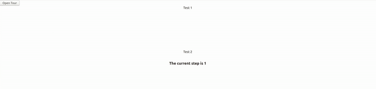

# dash tour component





dash tour component is a Dash component library.

Install though pip: 
> pip install dash-tour-component

To install locally:
1. Install Dash and its dependencies: https://dash.plotly.com/installation
2. Run `python usage.py`
3. Visit http://localhost:8050 in your web browser


## Proptypes 

Keyword arguments:
- children (a list of or a singular dash component, string or number | string; optional): Content to be rendered
Type: node | elem
- id (string; optional): The ID used to identify this component in Dash callbacks.
- accentColor (string; optional): Change --reactour-accent (defaults to accentColor on IE) css custom prop to apply color in Helper, number, dots, etc
Type: string
Default: string
- isOpen (boolean; optional): Whether the Tour component is currently open
- steps (dict; optional): The steps in the tour component. steps has the following type: list of dicts containing keys 'selector', 'content', 'position', 'action', 'style', 'stepInteraction', 'navDotAriaLabel'.
Those keys have the following types:
  - selector (string; optional)
  - content (string; required)
  - position (list of numbers | a value equal to: 'top', 'right', 'bottom', 'left', 'center'; optional)
  - action (optional)
  - style (dict; optional)
  - stepInteraction (boolean; optional)
  - navDotAriaLabel (string; optional)
- className (string; optional): Custom class name to add to the Helper
Type: string
- closeWithMask (boolean; optional): Close the Tour by clicking the Mask
Type: bool
- disableDotsNavigation (boolean; optional): Disable interactivity with Dots navigation in Helper
Type: bool
- disableInteraction (boolean; optional): Disable the ability to click or intercat in any way with the Highlighted element
Type: bool
- disableKeyboardNavigation (a value equal to: PropTypes.bool, PropTypes.array; optional): Disable all keyboard navigation (next and prev step) when true, disable only selected keys when array
Type: bool | array(['esc', 'right', 'left'])
- CurrentStep (number; optional): The Current step
- goTopStep (number; optional): Programmatically change current step after the first render, when the value changes
- highlightedMaskClassName (string; optional): Custom class name to add to the element which is the overlay for the target element when disableInteraction
- inViewThreshold (number; optional): Tolerance in pixels to add when calculating if an element is outside viewport to scroll into view
- maskClassName (string; optional): Custom class name to add to the Mask
- maskSpace (number; optional): Extra Space between in pixels between Highlighted element and Mask
- rounded (number; optional): Beautify Helper and Mask with border-radius (in px)
- scrollDuration (number; optional): Smooth scroll duration when positioning the target element (in ms)
- scrollOffset (number; optional): Offset when positioning the target element after scroll to it
- showButtons (boolean; optional): Show/Hide Helper Navigation buttons
- showCloseButton (boolean; optional): Show/Hide Helper Close button
- showNavigation (boolean; optional): Show/Hide Helper Navigation Dots
- showNavigationNumber (boolean; optional): Show/Hide number when hovers on each Navigation Dot
- showNumber (boolean; optional): Show/Hide Helper Number Badge
- startAt (number; optional): Starting step when Tour is open the first time
- update (string; optional): Value to listen if forced update is needed
- updateDelay (number; optional): Delay time when forcing update. Useful when there are known animation/transitions"""


## Contributing

See [CONTRIBUTING.md](./CONTRIBUTING.md)

### Install dependencies

If you have selected install_dependencies during the prompt, you can skip this part.

1. Install npm packages
    ```
    $ npm install
    ```
2. Create a virtual env and activate.
    ```
    $ virtualenv venv
    $ . venv/bin/activate
    ```
    _Note: venv\Scripts\activate for windows_

3. Install python packages required to build components.
    ```
    $ pip install -r requirements.txt
    ```
4. Install the python packages for testing (optional)
    ```
    $ pip install -r tests/requirements.txt
    ```

### Write your component code in `src/lib/components/Tour.react.js`.

- The demo app is in `src/demo` and you will import your example component code into your demo app.
- Test your code in a Python environment:
    1. Build your code
        ```
        $ npm run build
        ```
    2. Run and modify the `usage.py` sample dash app:
        ```
        $ python usage.py
        ```
- Write tests for your component.
    - A sample test is available in `tests/test_usage.py`, it will load `usage.py` and you can then automate interactions with selenium.
    - Run the tests with `$ pytest tests`.
    - The Dash team uses these types of integration tests extensively. Browse the Dash component code on GitHub for more examples of testing (e.g. https://github.com/plotly/dash-core-components)
- Add custom styles to your component by putting your custom CSS files into your distribution folder (`dash_tour_component`).
    - Make sure that they are referenced in `MANIFEST.in` so that they get properly included when you're ready to publish your component.
    - Make sure the stylesheets are added to the `_css_dist` dict in `dash_tour_component/__init__.py` so dash will serve them automatically when the component suite is requested.
- [Review your code](./review_checklist.md)

### Create a production build and publish:

1. Build your code:
    ```
    $ npm run build
    ```
2. Create a Python tarball
    ```
    $ python setup.py sdist
    ```
    This distribution tarball will get generated in the `dist/` folder

3. Test your tarball by copying it into a new environment and installing it locally:
    ```
    $ pip install dash_tour_component-0.0.1.tar.gz
    ```

4. If it works, then you can publish the component to NPM and PyPI:
    1. Publish on PyPI
        ```
        $ twine upload dist/*
        ```
    2. Cleanup the dist folder (optional)
        ```
        $ rm -rf dist
        ```
    3. Publish on NPM (Optional if chosen False in `publish_on_npm`)
        ```
        $ npm publish
        ```
        _Publishing your component to NPM will make the JavaScript bundles available on the unpkg CDN. By default, Dash serves the component library's CSS and JS locally, but if you choose to publish the package to NPM you can set `serve_locally` to `False` and you may see faster load times._

5. Share your component with the community! https://community.plotly.com/c/dash
    1. Publish this repository to GitHub
    2. Tag your GitHub repository with the plotly-dash tag so that it appears here: https://github.com/topics/plotly-dash
    3. Create a post in the Dash community forum: https://community.plotly.com/c/dash
